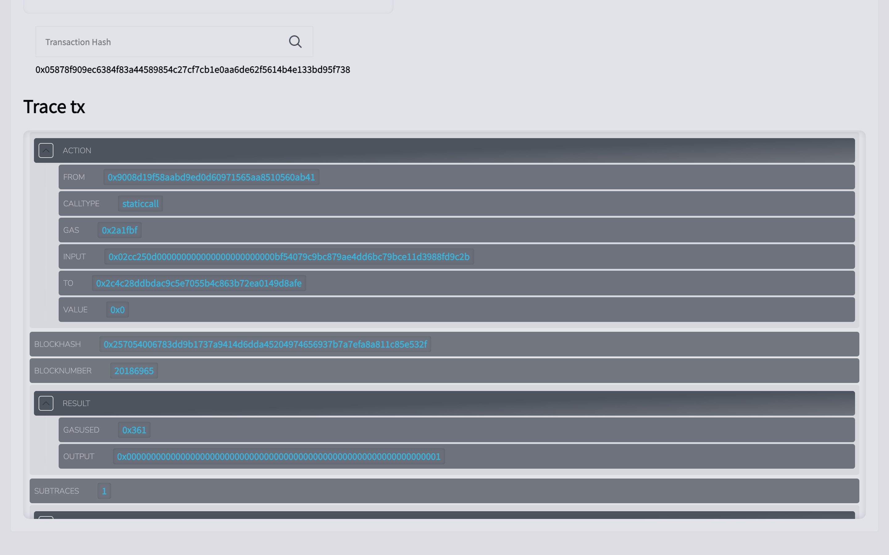

# QUICKNODE CHAINSIGHT

### Table of Content

- [Getting Started](#getting-started)

## Getting Started

First, run the development server:

```bash
npm run dev
# or
yarn dev
# or
pnpm dev
# or
bun dev
```

Open [http://localhost:3000](http://localhost:3000) with your browser to see the result.

## Inside the DApp

<div align="center">
    
    
</div>

<div align="center">
    
    
</div>

## Learn More

To learn more about QuickNode, take a look at the following resources:

- [QuickNode Documentation](https://www.quicknode.com/docs/welcome) - learn about QuickNode features and API.
